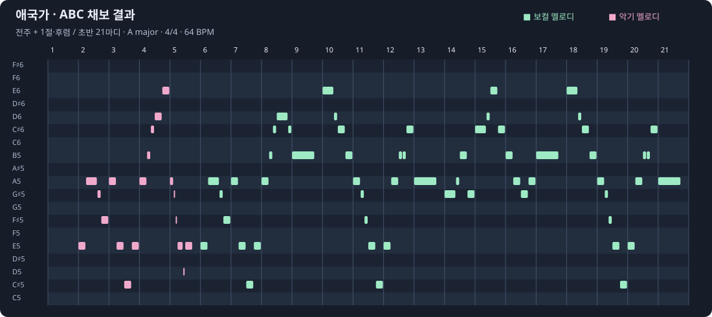

# ABC 악보 스튜디오

ComfyUI 안에서 **노래 샘플의 보컬 멜로디를 ABC 악보로 추출**하고, 피아노롤에서 듣고 고친다.

YuE2 · Generate Song 같은 노드에는 ABC 악보를 받는 `abc` 텍스트 칸이 있지만,
ABC는 사람이 손으로 쓰기 어려운 표기법이라 사실상 비워 두게 된다.
**ABC 악보 입력**에서 스튜디오를 열어 편집한다. 이 입력 노드를 생성 노드에 연결하면 생성 쪽의 중복 버튼은 숨긴다. 연결을 빼고 생성 노드를 단독으로 사용할 때는 생성 쪽에서 직접 스튜디오를 열 수 있다.

## 🎧 원본 → 장르 편곡 들어보기

애국가 합창 음원 전체를 **SheetSage2 → ABC 악보**로 채보하고, **YuE2**에 1~4절 가사와 함께 넣어 편곡했다. 같은 선율에서 템포와 장르를 바꾼 예시다.

### [▶ 세 곡 비교 플레이어 열기](https://nicekriss.github.io/toobusy-abc-studio/)

### 원곡을 ABC 악보로 바꾸면?



[▶ 채보한 음표 연주 듣기](https://nicekriss.github.io/toobusy-abc-studio/#abc-score) · [1~4절 전체 ABC 악보](docs/examples/aegukga-source.abc)

초록은 보컬, 분홍은 악기 주요 멜로디다. 이미지는 초반 21마디이며, 음표 연주는 전체 1~4절이다. **채보된 음표의 합성음 미리듣기**로, 원본의 보컬·반주를 분리한 음원은 아니다. 이 ABC 악보를 아래 편곡의 선율 조건으로 사용했다.

| 원본 | 헤비메탈 | K-pop 댄스 |
|---|---|---|
| 합창 · 4분 21초 | 기타·더블 킥 · 2분 7초 | 신스·댄스 비트 · 2분 13초 |
| 생성 시간 해당 없음 | **생성 3분 48초** | **생성 4분 7초** |
| [▶ 원본 듣기](https://nicekriss.github.io/toobusy-abc-studio/#original) | [▶ 헤비메탈 듣기](https://nicekriss.github.io/toobusy-abc-studio/#heavy-metal) | [▶ K-pop 댄스 듣기](https://nicekriss.github.io/toobusy-abc-studio/#kpop-dance) |

RTX 3090 24GB · torch-eager/SDPA에서 측정한 YuE2 생성 시간이다(각각 227.8초 / 247.3초). 별도 ABC 채보와 MP3 변환·업로드는 제외하며, 실행 환경에 따라 달라진다.

<details>
<summary>헤비메탈 프롬프트 · 생성 3분 48초 · seed 913101</summary>

```text
Epic Korean heavy metal anthem, 132 BPM, thick distorted rhythm guitars, palm-muted chugging riffs, double kick drums, powerful snare, driving bass guitar, twin lead guitar harmonies, soaring gritty male lead singer, triumphant gang-vocal chorus, tight modern metal production, energetic dramatic arrangement. Korean language vocals, perform all four verses and every repeated chorus exactly in the supplied order, clear intelligible Korean diction, recognizable Aegukga vocal melody from the supplied score, complete song with a resolved final cadence, no spoken introduction, no additional lyrics.
```

`planning=melody`. [전체 생성 설정 JSON — 프롬프트·1~4절 가사·ABC 악보·시드](docs/examples/aegukga-heavy-metal.json)

</details>

<details>
<summary>K-pop 댄스 프롬프트 · 생성 4분 7초 · seed 913103</summary>

```text
High-energy K-pop dance anthem, 128 BPM, bright expressive female lead vocals, layered pop vocal harmonies, four-on-the-floor kick, crisp claps, pumping synth bass, sparkling synth arpeggios, euphoric dance-pop chorus, rhythmic verses, modern glossy K-pop production, catchy melodic vocal delivery and a big final chorus. Korean language vocals, perform all four verses and every repeated chorus exactly in the supplied order, clear intelligible Korean diction, recognizable Aegukga vocal melody from the supplied score, complete song with a resolved final cadence, no spoken introduction, no additional lyrics.
```

`planning=melody`. [전체 생성 설정 JSON — 프롬프트·1~4절 가사·ABC 악보·시드](docs/examples/aegukga-kpop-dance.json)

</details>

원본은 [공유마당의 2018 애국가(합창) 1~4절](https://gongu.copyright.or.kr/gongu/wrt/wrt/view.do?wrtSn=13211046&menuNo=200020) — 안익태 작곡, 박인영 편곡, 서울시립교향악단·서울시합창단, 한국저작권위원회 공유마당의 ‘자유이용 기증’ 표시 음원이다. 두 편곡은 추출한 ABC와 전체 가사를 입력해 새로 생성한 결과이며, 음표나 가사 발음에 차이가 있을 수 있다. 출처·모델 라이선스는 비교 페이지에 함께 표시했다.

## 기능

- 한글 도레미가 적힌 건반, 그리기 · 선택 · 지우개 도구
- 곡 전체 미니맵, 가로세로 동시 확대
- 코드 반주 재생, 건반 클릭 미리듣기
- SheetSage2: 곡 전체 → 인스·보컬 멜로디, 박자·조·코드 채보 → 성부별 미리듣기 → 두 줄로 편집
- 마이크 녹음: 인스 멜로디 / 보컬 멜로디를 직접 선택해 각각의 줄에 넣기
- 보컬 멜로디와 악기 주요 멜로디를 별도 성부로 유지

악보 편집과 마이크 녹음은 브라우저에서, 노래 파일 채보는 별도 SheetSage2 실행 환경에서 동작한다.

## 노드

| 노드 | 하는 일 |
|---|---|
| **ABC 악보 입력** | 피아노롤로 그린 멜로디를 ABC 악보 텍스트(STRING)로 내보낸다. 악보를 따로 보관·재사용할 때 쓴다 |
| **ABC 악보 정보** | ABC 악보에서 조(key) · 박자(meter) · 템포(bpm) · 마디 수(bars)를 읽는다 |

버튼 자체는 두 노드가 없어도 `abc` 위젯을 가진 노드라면 어디에나 붙으므로,
YuE2 생성 노드에 바로 그려 넣어도 된다.

```
[ABC 악보 입력] --abc(STRING)--> [YuE2 · Generate Song]
```

## 설치

ComfyUI의 `custom_nodes` 폴더에서:

```bash
git clone https://github.com/nicekriss/toobusy-abc-studio.git
```

노래 파일 채보까지 사용하려면 **Windows · NVIDIA GPU** 환경에서 아래 설치기를 실행한다. `requirements.txt`는 ComfyUI 패키지를 변경하지 않는다.

```powershell
python custom_nodes/toobusy-abc-studio/install_sheetsage2.py --comfyui "D:/ComfyUI"
```

`--comfyui`에는 `main.py`가 있는 실제 경로를 넣는다. `--models`로 모델 루트, `--user-directory`로 별도 사용자 폴더도 지정할 수 있다. 설치기는 Python 3.11을 찾아 전용 환경을 만들고, 없으면 고정된 Astral python-build-standalone을 내려받는다. 관리자 권한이나 시스템 Python 교체는 필요 없다.

[YuE2 통합 설치기](https://github.com/nicekriss/2BZ-ComfyUI-Workflows/releases/tag/yue2-v0.1.0-rc8)는 이 단계까지 함께 처리한다. 업데이트 후 ComfyUI를 재시작하고 스튜디오를 다시 연다.

## 허밍·가사 노래를 따로 녹음하기

1. **마이크로 멜로디 넣기**를 열고 **인스 멜로디** 또는 **보컬 멜로디**를 선택한다. 기본은 인스 멜로디다.
2. 표시된 넣을 줄을 확인하고 **녹음 시작**을 누른다. 준비 박자가 끝나면 한 음씩 부른다. 마이크 권한이 필요하다.
3. **녹음 중지**를 누르면 녹음 시작 때의 재생 위치부터 선택한 줄에 넣는다. 한 번에 최대 90초다. 없는 성부는 음이 검출되었을 때 생성한다.
4. 다른 종류를 선택하고 다시 녹음하면 별도 성부에 들어간다. 기존 음은 유지하고 **되돌리기**로 한 번의 녹음과 새 성부 생성을 함께 취소한다.

허밍과 가사를 음색으로 자동 분류하지 않는다. 가사로 부른 음도 선택에 따라 인스나 보컬에 넣을 수 있으며, 가사 글자를 받아쓰는 기능은 아니다. ABC에서는 `V:Ins` / `V:Vocal`로 구분한다. 기존 표준 성부 ID 또는 `Ins Melody` / `Vocal Melody` 이름을 찾아 재사용하고, 이름이 다른 임의의 성부는 덮어쓰지 않는다.

녹음 중 탭이나 재생 위치가 바뀌어도 넣을 곳은 유지된다. 악보를 새로 불러오거나 조·박자 설정이 바뀌면 잘못된 위치에 넣지 않고 다시 녹음하도록 안내한다. **닫기**는 진행 중 녹음/분석을 취소한다. 조·박자 보정은 기본으로 꺼져 있다. 마이크는 한 번에 한 선율을 부르는 용도이며 반주가 섞인 파일에는 아래 노래 샘플 분석을 사용한다.

## 노래 파일로 악보 만들기

1. **노래에서 악보 만들기**에서 MP3/WAV/FLAC 등 음원을 고른다. 브라우저에서 전체 음원을 디코딩하지 않고 서버로 전송한다.
2. 기본은 **곡 전체**다. 일부만 필요하면 시작·종료 시간을 입력한다. 종료를 비우면 끝까지 분석한다. 90초 제한은 없으며 파일 크기는 최대 512 MiB다.
3. **커버용 — 인스·보컬 멜로디** 또는 **인스·보컬 멜로디와 코드**를 고른다.
4. 원본과 보컬 악보·인스 악보·두 멜로디를 비교한다. 미리듣기는 음표 연주이며 원음의 분리된 보컬/반주가 아니다.
5. **두 멜로디를 악보로 가져오기**로 불러온다. 이전 악보는 **되돌리기**로 복원할 수 있다. ABC와 MIDI를 직접 저장할 수도 있다.
6. 보컬/인스 줄을 골라 편집한 뒤 **이 악보 쓰기**를 누른다. 편집하지 않은 가져오기에서는 SheetSage2의 원래 ABC를 그대로 전달한다.

### YuE2로 커버 생성

- 커버용 악보는 `planning=melody`, 코드 포함 악보는 `planning=full`을 쓴다.
- 가사는 원곡과 구간·분량을 맞추고 원하는 스타일을 지정한다. 입력 악보는 모델의 생성 조건이며 원본 파형이나 초 단위 길이를 강제로 복사하지 않는다.
- 출력의 멜로디 일치는 원곡과 직접 비교해야 한다. 생성 성공이나 악보 전달 성공만으로 원곡 재현을 보장하지 않는다.

### 실행 환경

- 공식 [SheetSage2](https://huggingface.co/m-a-p/SheetSage2)와 [MERT-v2-FullSong](https://huggingface.co/m-a-p/MERT-v2-FullSong)을 고정 revision과 SHA256으로 받는다. 모델은 약 2.76 GB이며 가중치 라이선스는 CC BY-NC 4.0이다.
- `user/abc-studio/runtime`에 Python 3.11, Torch/torchaudio 2.8.0+cu128, Transformers 4.45.2 등 전용 패키지를 설치한다. 이 패키지들은 ComfyUI가 쓰는 버전과 함께 설치할 수 없어 환경을 따로 둔다. ComfyUI와 YuE2의 기존 패키지는 교체하지 않는다. 런타임과 다운로드 캐시를 포함해 추가 여유 공간 약 12 GB를 준비한다.
- 모델은 `models/abc_studio/SheetSage2`, `models/abc_studio/MERT-v2-FullSong`에 둔다. 설치 설정은 `user/abc-studio/setup.json`에 저장한다.
- 공식 300초 창과 겹침 문맥으로 긴 음원을 이어 분석한다. GPU 프로세스는 작업 후 종료하며 진행률과 취소를 제공한다. 임시 작업은 취소·서버 종료 또는 만료 시 정리한다.
- 음원은 접속한 ComfyUI 서버에서 분석한다. 외부 채보 API를 호출하지 않는다.
- 설치 끝에 그래픽카드가 설치된 Torch의 지원 목록에 있는지 대조하고 CUDA 커널을 한 번 실행한다. 지원하지 않는 카드면 곡을 분석하기 전에 설치가 멈춘다.

> **RTX 50 시리즈에서 "no kernel image is available" 오류가 났다면** v0.4.1 이하로 설치된 것이다.
> 그 버전은 sm_120 커널이 없는 cu126 Torch를 깔았다. 최신 설치기를 다시 실행하면 교체된다.

### 범위

악기 **주요 멜로디**와 **보컬 멜로디**, 박자·조·구조·선택적 코드를 채보한다. 모든 반주 악기의 개별 파트나 가사 받아쓰기는 제공하지 않는다. 겹친 음, 합창, 잔향, 꾸밈음은 누락되거나 잘못 분류될 수 있다. 전체 악보와 원음을 확인해 수정한다.

검증 결과와 한계는 [오디오 검증 문서](docs/audio-validation.md)를 참고한다.

> ComfyUI-Manager의 "Install via Git URL"로도 설치할 수 있다.
> 기본 설정에서는 그 기능이 꺼져 있으므로(`allow_git_url_install = False`)
> 필요하면 Manager 설정에서 켜거나, 위처럼 직접 `git clone` 하면 된다.

## toobusy 본체와의 관계

원래 [toobusy](https://github.com/nicekriss/toobusy) 노드팩 v0.5.0에 들어 있던
기능을 별도 저장소로 분리한 것이다. 악보 편집기는 성격이 뚜렷이 다른 도구라
본체에 묶어 둘 이유가 없었다.

**toobusy 본체와 이 확장을 같이 설치하면 버튼이 두 번 붙는다.** toobusy는
v0.5.1부터 스튜디오를 빼므로, 그 이전 버전을 쓰는 중이라면 둘 중 하나만 두면 된다.

## 라이선스

MIT — [LICENSE](LICENSE) 참고.
